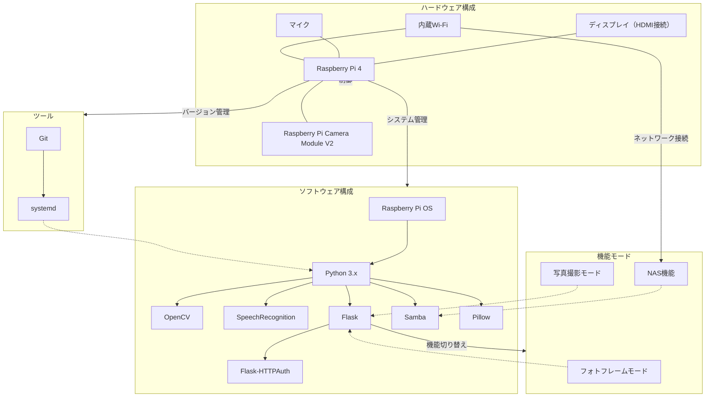

# Design Documentation　2.設計書

# 設計書（更新版）

## 1. はじめに

### 1.1 ドキュメントの目的

本設計書は、Raspberry Piを活用したフォトフレームおよび写真撮影機能を統合したインタラクティブデバイスの開発におけるシステム設計を詳細に記述するものです。要件定義書を基に、システムの構成、各コンポーネントの設計、インターフェース、データフローなどを明確にします。

### 1.2 用語定義

- Raspberry Pi: 本プロジェクトで使用するシングルボードコンピュータ。
- フォトフレームモード: スライドショー形式で画像を表示するモード。
- 写真撮影モード: 音声コマンドおよび笑顔検出により写真を撮影するモード。
- NAS機能: ネットワーク接続およびファイル共有機能。

## 2. システム概要

### 2.1 システム構成図

図1: システム全体のブロック図




### 2.2 コンポーネント説明

#### ハードウェアコンポーネント

- Raspberry Pi 4: 中央制御ユニットとして機能。
- Raspberry Pi Camera Module V2: 写真撮影用カメラ。
- ディスプレイ: HDMI接続で画像表示。
- マイク: 高品質な音声入力を担当。
- 内蔵Wi-Fi: Raspberry Pi 4に内蔵されているWi-Fiを使用。

#### ソフトウェアコンポーネント

- Raspberry Pi OS: オペレーティングシステム。
- Python 3.x: メインプログラミング言語。

##### ライブラリ

- OpenCV: 顔・笑顔検出用。
- SpeechRecognition: 音声認識用。
- Flask: ウェブインターフェース用。
- Samba: ファイル共有用。
- Flask-HTTPAuth: Flaskアプリケーションの基本認証用。
- Pillow: 画像処理用。

##### ツール

- Git: バージョン管理。
- systemd: サービス管理および自動起動。

## 3. 詳細設計

### 3.1 フォトフレーム機能

#### 3.1.1 自動スライドショー

- 機能概要: 指定フォルダ内の画像を一定間隔で自動的に表示。
- 実装方法:
    - 画像取得: `src/main.py`内で指定ディレクトリ（例：`/home/pi/photos`）から画像ファイルを取得。
    - 表示: tkinterとPillowライブラリを使用して画像を全画面表示。以下のようなコードスニペットを使用：

```python
# photoframe_tkinter.py
import tkinter as tk
from PIL import Image, ImageTk
import os
import time

class PhotoFrame(tk.Tk):
    def __init__(self, photo_directory, interval=5000):
        super().__init__()
        self.photo_directory = photo_directory
        self.interval = interval  # ミリ秒
        self.photos = self.load_photos()
        self.current = 0

        self.label = tk.Label(self)
        self.label.pack(expand=True)

        self.bind("<Escape>", lambda e: self.destroy())  # Escapeキーで終了
        self.attributes('-fullscreen', True)  # フルスクリーン表示

        self.show_photo()
    
    def load_photos(self):
        supported_formats = ('.png', '.jpg', '.jpeg', '.gif', '.bmp')
        return [os.path.join(self.photo_directory, f) for f in os.listdir(self.photo_directory) if f.lower().endswith(supported_formats)]
    
    def show_photo(self):
        if not self.photos:
            print("写真が見つかりません。")
            self.destroy()
            return
        
        photo_path = self.photos[self.current]
        img = Image.open(photo_path)
        img = img.resize((self.winfo_screenwidth(), self.winfo_screenheight()), Image.ANTIALIAS)
        photo = ImageTk.PhotoImage(img)
        self.label.config(image=photo)
        self.label.image = photo  # 参照を保持
        
        self.current = (self.current + 1) % len(self.photos)
        self.after(self.interval, self.show_photo)

if __name__ == "__main__":
    photo_directory = "/home/pi/photos"  # 写真ディレクトリのパス
    app = PhotoFrame(photo_directory, interval=5000)  # 5秒間隔
    app.mainloop()
```

- 設定: `config.yaml`に表示間隔（例：5秒）を設定可能。

#### 3.1.2 一定時間無操作時の切り替え

- 機能概要: 一定時間操作がない場合、フォトフレームモードに自動的に切り替わる。
- 実装方法:
    - 無操作検出: 音声入力の有無を監視。無操作時間をカウント。
    - タイマー設定: `threading.Timer`を使用して無操作時間を管理。
    - モード切替: 無操作時間が設定値を超えた場合、`start_slideshow`関数を呼び出してフォトフレームモードに遷移。
- 実装例:

```python
import threading
import time
from photoframe_tkinter import PhotoFrame
from photo_capture import capture_photo

def switch_to_slideshow(config):
    slideshow = PhotoFrame(config['slideshow']['photos_directory'], config['slideshow']['interval'])
    slideshow.mainloop()

def monitor_activity(config):
    last_activity = time.time()

    def reset_timer():
        nonlocal last_activity
        last_activity = time.time()

    while True:
        current_time = time.time()
        if current_time - last_activity > config['slideshow']['timeout']:
            switch_to_slideshow(config)
        time.sleep(1)
```

### 3.2 写真撮影機能

#### 3.2.1 音声操作による撮影

- 機能概要: 音声コマンドで写真を撮影。
- 実装方法:
    - 音声認識: SpeechRecognitionライブラリを使用して音声入力を解析。

```python
# voice_commands.py
import speech_recognition as sr
import cv2
import time
from photo_capture import capture_photo

def listen_for_commands():
    recognizer = sr.Recognizer()
    mic = sr.Microphone()
    with mic as source:
        recognizer.adjust_for_ambient_noise(source)
        print("音声コマンドを待機中...")
        audio = recognizer.listen(source)
    try:
        command = recognizer.recognize_google(audio, language='ja-JP')
        print(f"認識されたコマンド: {command}")
        return command
    except sr.UnknownValueError:
        print("コマンドが認識できませんでした。")
        return ""
    except sr.RequestError as e:
        print(f"音声認識サービスに接続できませんでした: {e}")
        return ""

def countdown(seconds):
    for i in range(seconds, 0, -1):
        print(f"{i}秒後に撮影します...")
        time.sleep(1)

def process_command(command, config):
    if "フォトフレームモードに切り替え" in command:
        print("フォトフレームモードに切り替えます。")
        switch_to_slideshow(config)
    elif "写真撮影モードに切り替え" in command:
        print("写真撮影モードに切り替えます。")
        # 写真撮影モードの具体的な処理をここに追加
    elif "写真撮影" in command:
        print("写真撮影コマンドを受け取りました。")
        countdown(3)
        capture_photo(config['slideshow']['photos_directory'])
```

#### 3.2.2 笑顔検出機能

- 機能概要: 笑顔を検出し、3カウント後に写真を撮影。
- 実装方法:
    - リアルタイム映像解析: OpenCVを使用してカメラ映像を解析。

```python
# smile_detection.py
import cv2
import time
from photo_capture import capture_photo

def detect_smile_and_capture(camera_index, save_path):
    face_cascade = cv2.CascadeClassifier(cv2.data.haarcascades + 'haarcascade_frontalface_default.xml')
    smile_cascade = cv2.CascadeClassifier(cv2.data.haarcascades + 'haarcascade_smile.xml')
    cap = cv2.VideoCapture(camera_index)
    if not cap.isOpened():
        print("カメラが開けません。")
        return
    while True:
        ret, frame = cap.read()
        if not ret:
            continue
        gray = cv2.cvtColor(frame, cv2.COLOR_BGR2GRAY)
        faces = face_cascade.detectMultiScale(gray, 1.3, 5)
        for (x, y, w, h) in faces:
            roi_gray = gray[y:y+h, x:x+w]
            smiles = smile_cascade.detectMultiScale(roi_gray, 1.8, 20)
            if len(smiles) > 0:
                print("笑顔が検出されました。3秒後に写真を撮影します。")
                countdown(3)
                capture_photo(save_path)
        time.sleep(0.1)
```

#### 3.2.3 自動保存

- 機能概要: 撮影した画像を自動で保存し、スライドショーに追加。
- 実装方法:
    - 保存場所: 撮影した画像は`/home/pi/photos`ディレクトリに保存。
    - スライドショーの更新: 新しい画像が追加されたことを検知し、スライドショーリストをリロード。

### 3.3 音声認識によるモード切り替えおよび操作

#### 3.3.1 音声コマンド

- 機能概要: 音声コマンドでモード切り替えや操作を実行。
- 実装方法:
    - コマンドリスト:
        - 「フォトフレームモードに切り替え」
        - 「写真撮影モードに切り替え」
        - 「写真撮影」
    - コマンド解析: `listen_for_commands`関数で取得したコマンドを解析し、対応する機能を呼び出す。

```python
# main.py
import threading
import time
from photoframe_tkinter import PhotoFrame
from voice_commands import listen_for_commands, process_command
from monitor_activity import monitor_activity

def main():
    config = load_config('config.yaml')

    # スライドショーのスレッド開始
    slideshow_thread = threading.Thread(target=start_slideshow, args=(config,))
    slideshow_thread.start()

    # 音声コマンドリスニングのスレッド開始
    command_thread = threading.Thread(target=command_listener, args=(config,))
    command_thread.start()

    # フォトフレームモード監視のスレッド開始
    monitor_thread = threading.Thread(target=monitor_activity, args=(config,))
    monitor_thread.start()

    # メインスレッドは終了しないように待機
    slideshow_thread.join()
    command_thread.join()
    monitor_thread.join()

def command_listener(config):
    while True:
        command = listen_for_commands()
        if command:
            process_command(command, config)

if __name__ == "__main__":
    main()
```

### 3.4 NAS機能

#### 3.4.1 ネットワーク接続（Wi-Fiのみ）

- 機能概要: Raspberry PiをWi-Fiネットワークに接続し、他デバイスからアクセス可能にする。
- 実装方法:
    - Wi-Fi設定: `wpa_supplicant.conf`を編集し、Wi-Fiネットワークに接続。

```bash
sudo nano /etc/wpa_supplicant/wpa_supplicant.conf
```

```ini
network={
    ssid="Your_SSID"
    psk="Your_Password"
    key_mgmt=WPA-PSK
}
```

- 設定適用:

```bash
sudo wpa_cli -i wlan0 reconfigure
```

- IPアドレス管理: DHCPを使用し、自動的にIPアドレスを取得。固定IPを設定する場合は、`dhcpcd.conf`を編集。

```bash
sudo nano /etc/dhcpcd.conf
```

```ini
interface wlan0
static ip_address=192.168.1.100/24
static routers=192.168.1.1
static domain_name_servers=192.168.1.1
```

#### 3.4.2 ファイル共有

- 機能概要: Sambaを利用して写真のアップロード・ダウンロードを可能にする。
- 実装方法:
    - Sambaインストール:

```bash
sudo apt-get update
sudo apt-get install samba samba-common-bin
```

- 共有フォルダ設定: `/home/pi/photos`ディレクトリを共有設定。

```ini
[photos]
path = /home/pi/photos
browseable = yes
writeable = yes
only guest = no
create mask = 0777
directory mask = 0777
valid users = pi
```

- ユーザー設定:

```bash
sudo smbpasswd -a pi
```

パスワードの設定を求められるので、強力なパスワードを設定してください。

- サービス再起動:

```bash
sudo systemctl restart smbd
```

#### 3.4.3 ウェブインターフェース

- 機能概要: ブラウザから写真の管理や設定変更ができるインターフェースを提供。
- 実装方法:
    - Flaskアプリケーションの構築: `src/web_app.py`にて構築。

```python
from flask import Flask, render_template, request, redirect, url_for, send_from_directory
from flask_httpauth import HTTPBasicAuth
from werkzeug.security import generate_password_hash, check_password_hash
import os

app = Flask(__name__)
PHOTO_DIR = '/home/pi/photos'
auth = HTTPBasicAuth()

# ユーザーとパスワードのハッシュ
users = {
    "admin": generate_password_hash("password123")  # パスワードは強力なものに変更
}

@auth.verify_password
def verify_password(username, password):
    if username in users and check_password_hash(users.get(username), password):
        return username

@app.route('/')
@auth.login_required
def dashboard():
    photos = os.listdir(PHOTO_DIR)
    return render_template('dashboard.html', photos=photos)

@app.route('/upload', methods=['POST'])
@auth.login_required
def upload_photo():
    if 'photo' in request.files:
        photo = request.files['photo']
        photo.save(os.path.join(PHOTO_DIR, photo.filename))
    return redirect(url_for('dashboard'))

@app.route('/download/<filename>')
@auth.login_required
def download_photo(filename):
    return send_from_directory(PHOTO_DIR, filename)

if __name__ == '__main__':
    # HTTPS設定が必要な場合は以下を使用
    # context = ('/etc/ssl/certs/flask.crt', '/etc/ssl/private/flask.key')
    # app.run(host='0.0.0.0', port=5000, ssl_context=context)
    
    # HTTPのみの場合
    app.run(host='0.0.0.0', port=5000)
```

- テンプレート作成: `templates/dashboard.html`にて写真一覧表示、アップロードフォーム、ダウンロードリンクを実装。

```html
<!DOCTYPE html>
<html lang="ja">
<head>
    <meta charset="UTF-8">
    <title>写真ダッシュボード</title>
    <style>
        body { font-family: Arial, sans-serif; }
        .photo { margin: 10px; display: inline-block; }
        .photo img { width: 200px; height: auto; display: block; }
    </style>
</head>
<body>
    <h1>写真ダッシュボード</h1>
    <form action="{{ url_for('upload_photo') }}" method="post" enctype="multipart/form-data">
        <input type="file" name="photo" accept="image/*" required>
        <button type="submit">アップロード</button>
    </form>
    <h2>アップロードされた写真</h2>
    <div>
        
            <div class="photo">
                
                <a href="{{ url_for('download_photo', filename=photo) }}" download>ダウンロード</a>
            </div>
        
    </div>
</body>
</html>
```

- ユーザー認証の実装: Flaskアプリケーションに基本認証を実装。Flask-HTTPAuthを使用して、全てのルートに認証を要求します。
- ユーザー名とパスワードの設定: `users`辞書内でユーザー名とパスワードを設定します。パスワードはハッシュ化されて保存されます。
- セキュリティ強化のための追加設定:
    - パスワードの強化: `users`辞書内のパスワードは、より強力なものに変更してください。
    - HTTPSの導入: FlaskアプリケーションにSSL/TLSを導入し、通信を暗号化します。Let’s Encryptを使用して無料の証明書を取得することができます。
    - Let’s Encryptの設定例:

```bash
sudo apt-get install certbot python3-certbot-nginx
sudo certbot --nginx -d your_domain.com
```

※ドメイン名が必要です。ローカルネットワーク内のみの場合、自己署名証明書を使用することも可能です。

### 3.5 セキュリティ強化

#### 3.5.1 ファイアウォール設定

- 機能概要: 不要なポートを閉じ、必要なポートのみを開放することで、システムのセキュリティを強化。
- 実装方法:
    - UFWのインストールと有効化

```bash
sudo apt-get update
sudo apt-get install ufw
sudo ufw default deny incoming
sudo ufw default allow outgoing
sudo ufw enable
```

- 必要なポートのみを開放
    - Flaskウェブサーバー（ポート5000）

```bash
sudo ufw allow 5000/tcp
```

- Sambaファイル共有（ポート137, 138, 139, 445）

```bash
sudo ufw allow 137,138,139,445/tcp
```

- ファイアウォールの状態確認

```bash
sudo ufw status
```

出力例:

```bash
Status: active

To                         Action      From
--                         ------      ----
5000/tcp                   ALLOW       Anywhere
137,138,139,445/tcp         ALLOW       Anywhere
5000/tcp (v6)              ALLOW       Anywhere (v6)
137,138,139,445/tcp (v6)    ALLOW       Anywhere (v6)
```

説明:

- デフォルト設定: 受信を全て拒否し（deny）、必要なポートのみを許可します。
- 必要なポートの開放: FlaskとSambaに必要なポートを明示的に許可することで、サービスの利用を可能にします。

#### 3.5.2 Samba設定の強化

- 機能概要: Samba共有において、信頼できるユーザーのみがアクセスできるように設定。
- 実装方法:
    - Samba設定ファイルの編集: `/etc/samba/smb.conf`を編集。

```ini
[photos]
path = /home/pi/photos
browseable = yes
writeable = yes
only guest = no
create mask = 0777
directory mask = 0777
valid users = pi
```

- ユーザーの追加: Sambaユーザーとしてpiユーザーを追加。

```bash
sudo smbpasswd -a pi
```

※パスワードは強力なものに設定してください。

- サービス再起動:

```bash
sudo systemctl restart smbd
```

#### 3.5.3 HTTPSの導入

- 機能概要: Flaskアプリケーションへのアクセスを暗号化し、セキュリティを強化。
- 実装方法:
    - Let’s Encryptの利用: ドメインがある場合、Certbotを使用して無料のSSL証明書を取得。

```bash
sudo apt-get install certbot python3-certbot-nginx
sudo certbot --nginx -d your_domain.com
```

- 自己署名証明書の使用: ローカルネットワークのみの場合、自己署名証明書を作成して使用。

```bash
openssl req -x509 -nodes -days 365 -newkey rsa:2048 -keyout /etc/ssl/private/flask.key -out /etc/ssl/certs/flask.crt
```

- Flaskアプリケーションの更新:

```python
if __name__ == "__main__":
    context = ('/etc/ssl/certs/flask.crt', '/etc/ssl/private/flask.key')
    app.run(host='0.0.0.0', port=5000, ssl_context=context)
```

## 4. データ管理設計

本プロジェクトでは、SQLiteなどのデータベースを使用せず、ファイルシステムを利用してデータ管理を行います。これにより、開発期間を短縮し、システムの複雑さを軽減します。

### 4.1 ディレクトリ構造

```bash
├── README.md               # プロジェクトの概要説明
├── src/                    # ソースコードのディレクトリ
│   ├── main.py             # メインプログラム
│   ├── utils.py            # 補助的な機能をまとめたモジュール
│   ├── web_app.py          # ウェブアプリケーション
│   ├── photoframe_tkinter.py # フォトフレーム表示モジュール（tkinter版）
│   ├── photo_capture.py    # 写真撮影モジュール
│   ├── voice_commands.py   # 音声認識モジュール
│   ├── smile_detection.py  # 笑顔検出モジュール
│   └── config.yaml         # 設定ファイル
├── docs/                   # ドキュメント用のディレクトリ
│   ├── requirements.md     # 要件定義書
│   ├── design.md           # 設計書
│   ├── implementation.md   # 実装メモ
│   ├── test_plan.md        # テスト計画書
│   └── test_results.md     # テスト結果記録
├── photos/                 # 撮影写真の保存ディレクトリ
├── templates/              # ウェブテンプレート
│   └── dashboard.html      # ダッシュボードページ
```

### 4.2 ファイル管理

- 画像ファイル: `photos/`ディレクトリに保存。
- 設定ファイル: `src/config.yaml`に保存。

```yaml
# スライドショー設定
slideshow:
  interval: 5000  # 表示間隔（ミリ秒）
  timeout: 60  # 無操作時間（秒）
  photos_directory: "/home/pi/photos"

# カメラ設定
camera:
  resolution: "1920x1080"

# Samba設定
samba:
  user: "pi"
  password: "your_strong_password"

# Flask設定
flask:
  host: "0.0.0.0"
  port: 5000
  debug: False
```

## 5. インターフェース設計

### 5.1 ユーザーインターフェース

#### 5.1.1 フォトフレームモード

- 画面構成:
    - 画像表示エリア: ディスプレイ全体に画像を表示。
    - 現在のモード表示: 画面の一部に「フォトフレームモード」と表示。
    - 音声コマンド受付表示: 音声入力状態を示すインジケーターを表示。

#### 5.1.2 写真撮影モード

- 画面構成:
    - プレビュー画面: カメラからのリアルタイム映像を表示。
    - 撮影カウントダウン表示: 撮影前に3秒カウントダウンを表示。
    - 音声コマンド受付表示: 音声入力状態を示すインジケーターを表示。

### 5.2 ウェブインターフェース

- ページ構成:
    - ダッシュボード: 写真の一覧表示。サムネイル表示とダウンロードリンクを提供。
    - 写真アップロード・ダウンロード機能: 写真のアップロードフォームとダウンロードリンク。
    - 設定管理ページ: スライドショー設定（表示間隔など）、音声コマンド設定（コマンドの追加・変更など）。
    - ユーザー認証ページ: 基本認証によりアクセスを制限。

## 6. システムアーキテクチャ

### 6.1 ソフトウェアアーキテクチャ

- モジュール構成:
    - メインモジュール（`main.py`）: システムのエントリーポイント。モード管理、タスクスケジューリングを担当。
    - ユーティリティモジュール（`utils.py`）: 共通機能（設定読み込み、ログ管理など）を提供。
    - 音声認識モジュール（`voice_commands.py`）: 音声コマンドの解析と処理を担当。
    - カメラ制御モジュール（`photo_capture.py`）: 写真撮影およびプレビュー制御を担当。
    - フォトフレーム表示モジュール（`photoframe_tkinter.py`）: スライドショーの管理と表示を担当（tkinter版）。
    - 笑顔検出モジュール（`smile_detection.py`）: 笑顔検出と自動撮影を担当。
    - ウェブサーバーモジュール（`web_app.py`）: ウェブインターフェースの提供を担当。

### 6.2 ハードウェアアーキテクチャ

- 接続図:
    - Raspberry Pi 4:
        - カメラモジュール: CSIポートに接続。
        - ディスプレイ: HDMIポートに接続。
        - マイク: USBポートに接続。
        - Wi-Fi: 内蔵Wi-Fiを使用。
        - 電源供給: 安定した電源供給を確保（例：5V 3Aのアダプタ）。

## 7. セキュリティ設計

### 7.1 セキュリティ設計

ユーザー認証機能を追加し、ウェブインターフェースやファイル共有機能へのアクセスを制限します。これにより、ネットワーク内の信頼できるデバイスからのみアクセス可能とし、セキュリティを強化します。

#### ネットワークセキュリティ:

- ファイアウォール設定: ufwを使用して必要なポート（例：5000番ポート）のみを開放。

```bash
sudo ufw allow 5000/tcp       # Flaskアプリケーション
sudo ufw allow 137,138,139,445/tcp  # Samba
sudo ufw enable
```

- IPフィルタリング: 特定のIPアドレスからのみアクセスを許可する設定を検討。ただし、今回は簡略化のため省略します。

#### データ保護:

- 通信の暗号化: FlaskアプリケーションにSSL/TLSを導入し、HTTPSを使用。Let’s Encryptなどを利用して証明書を取得。
- Let’s Encryptの設定例:

```bash
sudo apt-get install certbot python3-certbot-nginx
sudo certbot --nginx -d your_domain.com
```

※ドメイン名が必要です。ローカルネットワーク内のみの場合、自己署名証明書を使用することも可能です。

- ファイル共有の制限: Samba設定において、信頼できるユーザーのみがアクセスできるように設定（例：valid usersを特定ユーザーに限定）。

#### エラーハンドリング:

- 音声認識の誤認識防止: 音声コマンドのフィルタリングを強化。不要なノイズを排除するための音声前処理を実装。
- システムエラー時の対応: loggingモジュールを使用してエラーログを記録。systemdのRestartオプションを使用して自動再起動を設定。
- systemdサービスファイルの例: `/etc/systemd/system/photo_frame.service`

```ini
[Unit]
Description=Photo Frame Service
After=network.target

[Service]
ExecStart=/usr/bin/python3 /home/pi/photo_frame/src/main.py
Restart=always
User=pi
Environment=PYTHONUNBUFFERED=1

[Install]
WantedBy=multi-user.target
```

### 7.2 ユーザー認証

- Samba認証: Samba共有に対してユーザー認証を設定。piユーザーを使用。

```ini
[photos]
path = /home/pi/photos
browseable = yes
writeable = yes
only guest = no
create mask = 0777
directory mask = 0777
valid users = pi
```

- Flask基本認証: Flaskアプリケーションに基本認証を実装し、ウェブインターフェースへのアクセスを制限。

```python
# web_app.py
from flask import Flask, render_template, request, redirect, url_for, send_from_directory
from flask_httpauth import HTTPBasicAuth
from werkzeug.security import generate_password_hash, check_password_hash
import os

app = Flask(__name__)
PHOTO_DIR = '/home/pi/photos'
auth = HTTPBasicAuth()

# ユーザーとパスワードのハッシュ
users = {
    "admin": generate_password_hash("password123")  # パスワードは強力なものに変更
}

@auth.verify_password
def verify_password(username, password):
    if username in users and check_password_hash(users.get(username), password):
        return username

@app.route('/')
@auth.login_required
def dashboard():
    photos = os.listdir(PHOTO_DIR)
    return render_template('dashboard.html', photos=photos)

@app.route('/upload', methods=['POST'])
@auth.login_required
def upload_photo():
    if 'photo' in request.files:
        photo = request.files['photo']
        photo.save(os.path.join(PHOTO_DIR, photo.filename))
    return redirect(url_for('dashboard'))

@app.route('/download/<filename>')
@auth.login_required
def download_photo(filename):
    return send_from_directory(PHOTO_DIR, filename)

if __name__ == '__main__':
    # HTTPS設定が必要な場合は以下を使用
    # context = ('/etc/ssl/certs/flask.crt', '/etc/ssl/private/flask.key')
    # app.run(host='0.0.0.0', port=5000, ssl_context=context)
    
    # HTTPのみの場合
    app.run(host='0.0.0.0', port=5000)
```

## 8. テスト計画

### 8.1 テスト項目

#### 機能テスト:

- フォトフレームモードの画像表示とスライドショー機能の確認（tkinter版）。
- 写真撮影機能（音声操作および笑顔検出）の動作確認。
- 音声コマンドによるモード切替と操作の確認。
- NAS機能（Sambaおよびウェブインターフェース）の動作確認。
- ユーザー認証機能の確認。

#### 性能テスト:

- リアルタイムでの顔・笑顔検出の遅延評価。
- スライドショーの表示遅延評価。
- 音声認識の応答速度と精度の評価。

#### セキュリティテスト:

- Sambaの認証機能の強度テスト。
- ウェブインターフェースへの不正アクセス試行と防御機能の確認。
- 通信の暗号化状態の確認。

#### ユーザビリティテスト:

- ユーザーインターフェースの操作性評価。
- 設定変更やアップデートの容易さの確認。

### 8.2 テスト手順

- テストケース作成: 各機能に対する具体的なテストケースを文書化。
- テスト実施: テストケースに基づき、実機環境でテストを実施。
- 結果記録: テスト結果を`docs/test_results.md`に記録。
- 不具合修正: 発見されたバグを修正し、再テストを実施。

## 9. 開発スケジュール

### 9.1 タイムライン

| 日数 | タスク |
|---|---|
| 1日目-2日目 | 環境設定およびハードウェアのセットアップ |
| 3日目-5日目 | フォトフレーム機能の実装（tkinter版） |
| 6日目-8日目 | 写真撮影機能の実装 |
| 9日目-10日目 | 音声認識モジュールの統合 |
| 11日目-12日目 | NAS機能およびウェブインターフェースの実装 |
| 13日目 | 総合テストおよびデバッグ |
| 14日目 | ドキュメント作成および最終調整 |

### 9.2 マイルストーン

#### 第1週:

- 環境設定完了
- フォトフレーム機能実装完了（tkinter版）
- 写真撮影機能の基礎実装完了

#### 第2週:

- 音声認識モジュール統合完了
- NAS機能およびウェブインターフェース実装完了
- 総合テストおよび最終調整完了

## 10. リスク管理

### 10.1 ハードウェア故障

- リスク内容: Raspberry Piやカメラモジュールの故障。
- 対策: 予備部品を準備し、故障時に迅速に交換できる体制を整える。

### 10.2 ソフトウェアのバグ

- リスク内容: 各機能の不具合やクラッシュ。
- 対策: 定期的なコードレビューとテストを実施し、バグの早期発見と修正を行う。

### 10.3 音声認識の誤動作

- リスク内容: 音声コマンドの誤認識や認識漏れ。
- 対策: 音声認識の精度向上のためのマイク設定調整とフィルタリング機能を実装。

### 10.4 スケジュール遅延

- リスク内容: 各タスクの遅延によりプロジェクト全体の進行が遅れる。
- 対策: タスクを細分化し、毎日の進捗を確認。遅延が発生した場合は迅速に対応策を検討。

## 11. 付録

### 11.1 参考資料

- Qiita: Raspberry Pi フォトフレームプロジェクト
- Flask Documentation
- OpenCV Documentation
- Samba Documentation
- Flask-HTTPAuth Documentation
- Pillow Documentation

### 11.2 用語集

- NAS: Network Attached Storageの略。ネットワーク経由でアクセス可能なストレージ。
- Samba: WindowsとUnix/Linux間でファイル共有を行うためのソフトウェア。
- Flask: Python製の軽量ウェブフレームワーク。
- OpenCV: 画像処理およびコンピュータビジョン用のオープンソースライブラリ。
- Pillow: Pythonの画像処理ライブラリ。

## 追加情報

### ディレクトリ構造の詳細

```bash
├── README.md               # プロジェクトの概要説明
├── src/                    # ソースコードのディレクトリ
│   ├── main.py             # メインプログラム
│   ├── utils.py            # 補助的な機能をまとめたモジュール
│   ├── web_app.py          # ウェブアプリケーション
│   ├── photoframe_tkinter.py # フォトフレーム表示モジュール（tkinter版）
│   ├── photo_capture.py    # 写真撮影モジュール
│   ├── voice_commands.py   # 音声認識モジュール
│   ├── smile_detection.py  # 笑顔検出モジュール
│   └── config.yaml         # 設定ファイル
├── docs/                   # ドキュメント用のディレクトリ
│   ├── requirements.md     # 要件定義書
│   ├── design.md           # 設計書
│   ├── implementation.md   # 実装メモ
│   ├── test_plan.md        # テスト計画書
│   └── test_results.md     # テスト結果記録
├── photos/                 # 撮影写真の保存ディレクトリ
├── templates/              # ウェブテンプレート
│   └── dashboard.html      # ダッシュボードページ
```

### 設定ファイル（config.yaml）の例

```yaml
# スライドショー設定
slideshow:
  interval: 5000  # 表示間隔（ミリ秒）
  timeout: 60  # 無操作時間（秒）
  photos_directory: "/home/pi/photos"

# カメラ設定
camera:
  resolution: "1920x1080"

# Samba設定
samba:
  user: "pi"
  password: "your_strong_password"

# Flask設定
flask:
  host: "0.0.0.0"
  port: 5000
  debug: False
```

### メインプログラム（main.py）の概要

## main.py

```python
# main.py
import threading
import time
from utils import load_config
from photoframe_tkinter import PhotoFrame
from voice_commands import listen_for_commands, process_command
from monitor_activity import monitor_activity

def main():
    config = load_config('config.yaml')

    # スライドショーのスレッド開始
    slideshow_thread = threading.Thread(target=start_slideshow, args=(config,))
    slideshow_thread.start()

    # 音声コマンドリスニングのスレッド開始
    command_thread = threading.Thread(target=command_listener, args=(config,))
    command_thread.start()

    # フォトフレームモード監視のスレッド開始
    monitor_thread = threading.Thread(target=monitor_activity, args=(config,))
    monitor_thread.start()

    # メインスレッドは終了しないように待機
    slideshow_thread.join()
    command_thread.join()
    monitor_thread.join()

def command_listener(config):
    while True:
        command = listen_for_commands()
        if command:
            process_command(command, config)

if __name__ == "__main__":
    main()
```

## ユーティリティモジュール（utils.py）の概要

```python
# utils.py
import yaml

def load_config(config_path):
    with open(config_path, 'r') as file:
        config = yaml.safe_load(file)
    return config
```

## フォトフレーム表示モジュール（photoframe_tkinter.py）の概要

```python
# photoframe_tkinter.py
import tkinter as tk
from PIL import Image, ImageTk
import os
import time

class PhotoFrame(tk.Tk):
    def __init__(self, photo_directory, interval=5000):
        super().__init__()
        self.photo_directory = photo_directory
        self.interval = interval  # ミリ秒
        self.photos = self.load_photos()
        self.current = 0

        self.label = tk.Label(self)
        self.label.pack(expand=True)

        self.bind("<Escape>", lambda e: self.destroy())  # Escapeキーで終了
        self.attributes('-fullscreen', True)  # フルスクリーン表示

        self.show_photo()
    
    def load_photos(self):
        supported_formats = ('.png', '.jpg', '.jpeg', '.gif', '.bmp')
        return [os.path.join(self.photo_directory, f) for f in os.listdir(self.photo_directory) if f.lower().endswith(supported_formats)]
    
    def show_photo(self):
        if not self.photos:
            print("写真が見つかりません。")
            self.destroy()
            return
        
        photo_path = self.photos[self.current]
        img = Image.open(photo_path)
        img = img.resize((self.winfo_screenwidth(), self.winfo_screenheight()), Image.ANTIALIAS)
        photo = ImageTk.PhotoImage(img)
        self.label.config(image=photo)
        self.label.image = photo  # 参照を保持
        
        self.current = (self.current + 1) % len(self.photos)
        self.after(self.interval, self.show_photo)
```

## 写真撮影モジュール（photo_capture.py）の概要

```python
# photo_capture.py
import picamera
import picamera.array
import cv2
import datetime
import os
import time

def capture_photo(photo_directory):
    timestamp = datetime.datetime.now().strftime("%Y%m%d_%H%M%S")
    photo_path = os.path.join(photo_directory, f"photo_{timestamp}.jpg")
    
    with picamera.PiCamera() as camera:
        camera.resolution = (1920, 1080)
        camera.start_preview()
        time.sleep(2)  # カメラの調整時間
        with picamera.array.PiRGBArray(camera) as stream:
            camera.capture(stream, format='bgr')
            img = stream.array
            cv2.imwrite(photo_path, img)
    
    print(f"写真を保存しました: {photo_path}")
```

## 音声認識モジュール（voice_commands.py）の概要

```python
# voice_commands.py
import speech_recognition as sr
import cv2
import time
from photo_capture import capture_photo

def listen_for_commands():
    recognizer = sr.Recognizer()
    mic = sr.Microphone()
    with mic as source:
        recognizer.adjust_for_ambient_noise(source)
        print("音声コマンドを待機中...")
        audio = recognizer.listen(source)
    try:
        command = recognizer.recognize_google(audio, language='ja-JP')
        print(f"認識されたコマンド: {command}")
        return command
    except sr.UnknownValueError:
        print("コマンドが認識できませんでした。")
        return ""
    except sr.RequestError as e:
        print(f"音声認識サービスに接続できませんでした: {e}")
        return ""

def countdown(seconds):
    for i in range(seconds, 0, -1):
        print(f"{i}秒後に撮影します...")
        time.sleep(1)

def process_command(command, config):
    if "フォトフレームモードに切り替え" in command:
        print("フォトフレームモードに切り替えます。")
        # フォトフレームモードへの切り替え処理をここに追加
    elif "写真撮影モードに切り替え" in command:
        print("写真撮影モードに切り替えます。")
        # 写真撮影モードへの切り替え処理をここに追加
    elif "写真撮影" in command:
        print("写真撮影コマンドを受け取りました。")
        countdown(3)
        capture_photo(config['slideshow']['photos_directory'])
```

## 笑顔検出モジュール（smile_detection.py）の概要

```python
# smile_detection.py
import cv2
import time
from photo_capture import capture_photo

def detect_smile_and_capture(camera_index, save_path):
    face_cascade = cv2.CascadeClassifier(cv2.data.haarcascades + 'haarcascade_frontalface_default.xml')
    smile_cascade = cv2.CascadeClassifier(cv2.data.haarcascades + 'haarcascade_smile.xml')
    cap = cv2.VideoCapture(camera_index)
    if not cap.isOpened():
        print("カメラが開けません。")
        return
    while True:
        ret, frame = cap.read()
        if not ret:
            continue
        gray = cv2.cvtColor(frame, cv2.COLOR_BGR2GRAY)
        faces = face_cascade.detectMultiScale(gray, 1.3, 5)
        for (x, y, w, h) in faces:
            roi_gray = gray[y:y+h, x:x+w]
            smiles = smile_cascade.detectMultiScale(roi_gray, 1.8, 20)
            if len(smiles) > 0:
                print("笑顔が検出されました。3秒後に写真を撮影します。")
                countdown(3)
                capture_photo(save_path)
        time.sleep(0.1)
```

## 12. システム構築手順

### 12.1 ハードウェアのセットアップ

**Raspberry Pi 4の準備:**

*   Raspberry Pi OSをインストールし、初期設定を行います。
*   カメラモジュールをCSIポートに接続し、raspi-configでカメラを有効化します。
*   HDMIディスプレイを接続し、マイクをUSBポートに接続します。

**電源供給:**

*   安定した電源（例：5V 3Aのアダプタ）を接続します。

### 12.2 ソフトウェアのセットアップ

**必要なライブラリのインストール:**

```bash
sudo apt-get update
sudo apt-get install python3-pip python3-picamera python3-opencv python3-flask python3-samba
pip3 install pygame SpeechRecognition Flask-HTTPAuth Pillow
```

**プロジェクトディレクトリの作成:**

```bash
mkdir -p ~/photo_frame/src ~/photo_frame/photos ~/photo_frame/templates ~/photo_frame/docs
cd ~/photo_frame
```

**コードファイルの作成:**

上記の各モジュール (main.py, utils.py, photoframe_tkinter.py, photo_capture.py, voice_commands.py, smile_detection.py, web_app.py) を `src/` ディレクトリに作成します。  
`templates/dashboard.html` を作成します。

**設定ファイルの作成:**

`src/config.yaml` を作成し、上記の設定例に従って記述します。

### 12.3 サービスの設定

**systemdサービスファイルの作成:**

```bash
sudo nano /etc/systemd/system/photo_frame.service
```

```ini
[Unit]
Description=Photo Frame Service
After=network.target

[Service]
ExecStart=/usr/bin/python3 /home/pi/photo_frame/src/main.py
Restart=always
User=pi
Environment=PYTHONUNBUFFERED=1

[Install]
WantedBy=multi-user.target
```

**サービスの有効化と開始:**

```bash
sudo systemctl daemon-reload
sudo systemctl enable photo_frame.service
sudo systemctl start photo_frame.service
```

## 13. 運用・保守

### 13.1 定期メンテナンス

システムのアップデートを定期的に実施します。

```bash
sudo apt-get update
sudo apt-get upgrade
```

### 13.2 バックアップ

`photos/` ディレクトリの定期的なバックアップを行います。  
設定ファイル（`config.yaml`）やコードファイルのバックアップも推奨します。

### 13.3 ログ管理

`logging`モジュールを使用して、システムログを記録します。  
ログファイルの監視と定期的なクリーニングを行います。

## 14. まとめ

本設計書では、ユーザー認証機能を含み、SQLiteを使用せず、Wi-Fiのみを利用するRaspberry Piベースのフォトフレームおよび写真撮影システムの詳細な設計を提供しました。セキュリティを強化しつつ、開発期間内にプロジェクトを完了させるために必要な全ての要素を網羅しています。
